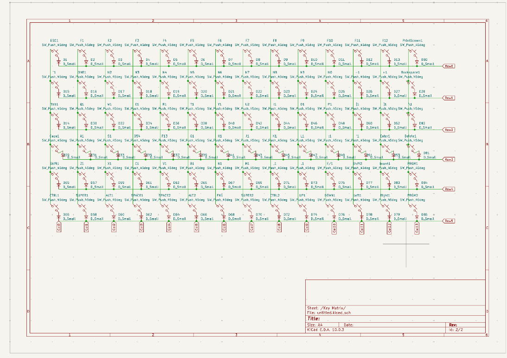
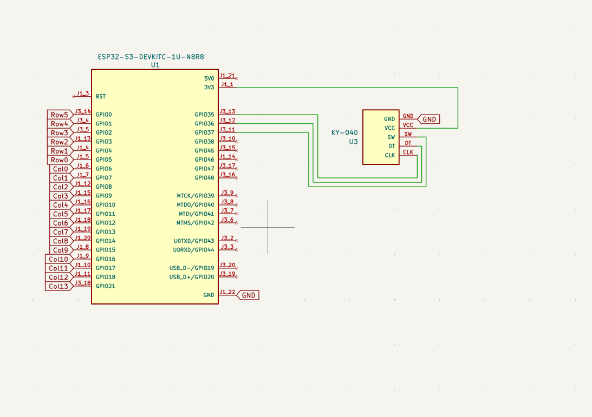

# Journal 

## Hour 1. 

- Created Key Matrix with diodes.
- Includes 85 keys including all keys of a standard keyboard minus a few unused.
- 2 programable keys for custom shortcuts.

## Hour 2.

- Using ESP32 to connect via bluetooth or wifi. 
- Rotary encoder with breakout added for volume control. 
- Using ESP32 dev kit because it has enough pins for matrix, rotary encoder and screen. 
